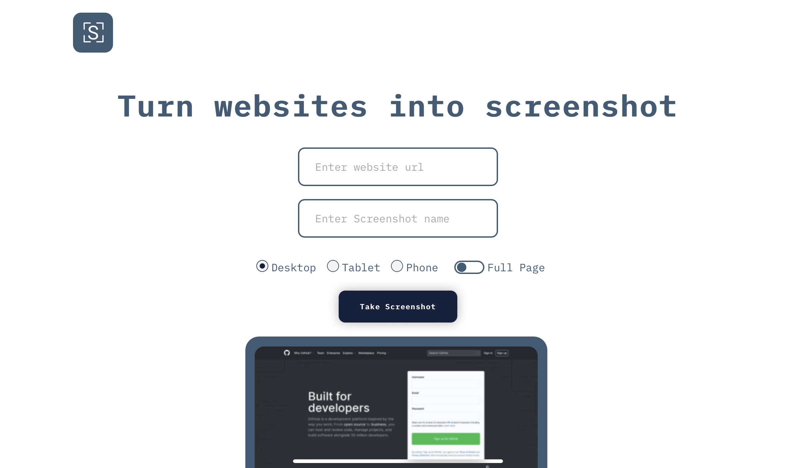

## 本地开发
#### 安装依赖
```bash
yarn install
```
#### 修改API地址

修改`components/screenshot.tsx`第26行为你的API地址

API部署可见[bestruirui/WebScreenShot--API](https://github.com/bestruirui/WebScreenShot--API)
#### 运行
```bash
yarn dev
```
打开 [http://localhost:3000](http://localhost:3000) 

## 部署在 Vercel
当你调试完成以后可直接部署在Vercel
> ## Warning
>
> ## vercel的node版本要设置成16
